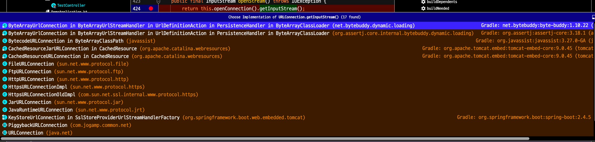

spring boot 어플리케이션에서 resources 하위에 있는 파일을 읽으려고 다음과 같은 코드를 작성했다.

```kotlin
val bytes = Files.readAllBytes(ResourceUtils.getFile(ClassPathResource("$filename").uri).toPath())
println(String(bytes))
```

로컬 IDE 에서 해당 코드는 정상적으로 동작해 배포 후에 기능을 테스트 하려고 했다.  
하지만 배포 후 이 코드는 FileNotFoundException 을 발생시키며 제대로 동작하지 않았다.  
로컬에서는 정상적으로 파일을 읽어왔는데 배포 후에 파일을 찾지 못하는 이유가 무엇일까?  
원인 파악을 위해 로그를 좀더 추가해보자


```kotlin
val fileUri = ClassPathResource("$filename").uri
val filePath = ResourceUtils.getFile(fileUri).toPath()
println("fileUri : $fileUri")
println("filePath : $filePath")
val bytes = Files.readAllBytes(filePath)

return String(bytes)
```

위의 코드를 로컬 IDE 에서 실행했을때 로그는 다음과 같이 찍힌다 
```
fileUri : file:/Users/minu/personal/spring-practice/build/resources/main/$filename
filePath : /Users/minu/personal/spring-practice/build/resources/main/$filename
```

배포한 코드의 에러 로그를 보면 파일 경로는 다음과 같이 찍혀있다
```
java.io.FileNotFoundException: URI cannot be resolved to absolute file path because it does not reside in the file system: jar:file:/Users/minu/personal/spring-practice/build/libs/demo-0.0.1-SNAPSHOT.jar!/BOOT-INF/classes!/$filename 
```

배포한 코드의 에러로그를 보면 파일의 경로가 jar:file 로 시작하는데, 로컬에서는 file: 로 시작하는걸 볼수 있다.

위에서 사용한 ResourceUtils.getFile 내부 코드를 보자

```java
class ResourceUtils {
    public static final String URL_PROTOCOL_FILE = "file";
    // ...
    
    public static File getFile(URI resourceUri, String description) throws FileNotFoundException {
        Assert.notNull(resourceUri, "Resource URI must not be null");
        if (!URL_PROTOCOL_FILE.equals(resourceUri.getScheme())) {
            throw new FileNotFoundException(
                    description + " cannot be resolved to absolute file path " +
                            "because it does not reside in the file system: " + resourceUri);
        }
        return new File(resourceUri.getSchemeSpecificPart());
    }
}
```

코드를 보면 URL_PROTOCOL_FILE (file:) 이 아닌 경우 에러를 발생시키고 있는데, jar 파일에서 해당 파일의 url 을 보면 jar: 로 시작하는걸 알수 있다.  
때문에 배포한 코드에서 getFile 을 이용하여 파일에 접근할 시 FileNotFoundException 이 발생했던 거였다.  

그렇다면 어떻게 해결할수 있을까? 해결방법은 의외로 간단했다.  
getFile 대신 inputStream 을 가져와 파일을 읽으면 된다.

```kotlin
val bytes = ClassPathResource("data.sql").inputStream.readBytes()
println(String(bytes))
return String(bytes)
```

inputStream 으로 가져오면 잘 동작하는 이유는 무엇일까?   


```java
class ClassPathResource {
    // ...
    @Override
    public InputStream getInputStream() throws IOException {
        InputStream is;
        if (this.clazz != null) {
            is = this.clazz.getResourceAsStream(this.path);
        }
        else if (this.classLoader != null) {
            is = this.classLoader.getResourceAsStream(this.path);
        }
        else {
            is = ClassLoader.getSystemResourceAsStream(this.path);
        }
        if (is == null) {
            throw new FileNotFoundException(getDescription() + " cannot be opened because it does not exist");
        }
        return is;
    }
} 

class ClassLoader {
    // ...
    public InputStream getResourceAsStream(String name) {
        Objects.requireNonNull(name);
        URL url = this.getResource(name);

        try {
            return url != null ? url.openStream() : null;
        } catch (IOException var4) {
            return null;
        }
    }
}

class URL {
    // ...
    public final InputStream openStream() throws IOException {
        return this.openConnection().getInputStream();
    }
}
```


내부 구현을 따라가보면 classLoader 에게 getResourceAsStream 을 요청하고,  
URL 이 URLConnection.inputStream 을 가져오는데 이 inputStream 을 구현하고 있는 구현체들이 여러개가 있다.  
그중에 FileURLConnection, JarURLConnection 이 존재해 다형성을 이용해 각 경우 (로컬, jar file) 에 맞게 inputStream 을 가져오는 것을 알수 있다.  

매우 간단한 기능이지만 제대로 알고 쓰지 못해 위와 같은 에러를 만났다.

참고 :
https://stackoverflow.com/a/20389418  
https://homoefficio.github.io/2020/07/21/IDE-%EC%97%90%EC%84%9C%EB%8A%94-%EB%90%98%EB%8A%94%EB%8D%B0-jar-%EC%97%90%EC%84%9C%EB%8A%94-%EC%95%88-%EB%8F%BC%EC%9A%94-Java-Resource/