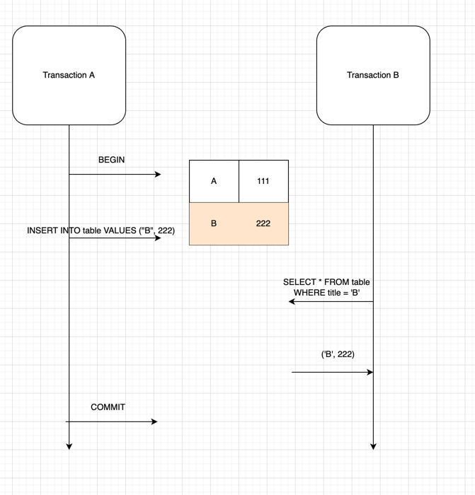
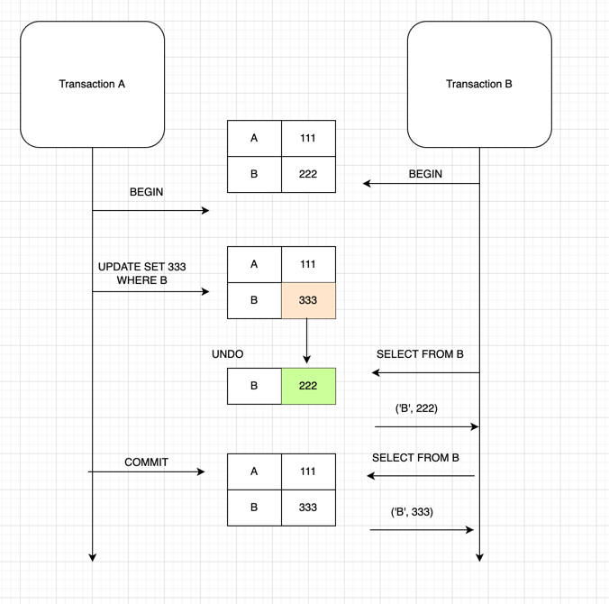
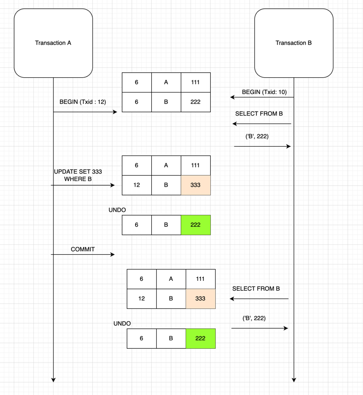

## 동시성

동시성은 소프트웨어 개발에서 가장 까다로운 측면 중 하나다. 동시성 문제를 해결하기 어려운 이유 중 하나는 문제의 모든 원인을 미리 알기 어렵기 때문이다.  
트랜잭션 매니저 같은 기능이 동시성의 여러 문제점을 예방하는 기능을 제공하지만, 단일 데이터베이스 트랜잭션으로 묶을 수 없는 타 시스템과의 상호작용 등이 많은 경우 
트랜잭션 매니저만을 믿을 수는 없다.  
이와 같이 여러 데이터베이스 트랜잭션에 걸쳐 조작되는 데이터에 대한 동시성 제어를 오프라인 동시성(offline concurrency) 라 한다.  

### 동시성 문제
동시성의 핵심적 문제를 알아보자

#### 손실된 업데이트 (lost update)
A 란 사람이 한 파일의 특정 메서드를 몇 분 동안 수정한다고 가정해보자.  
그러던 중 B 란 사람이 해당 파일의 다른 메서드를 변경한다.  
B의 작업 속도가 훨씬 빠르기 때문에 A 보다 나중에 시작했지만 먼저 파일을 저장했다.  
A 가 읽은 파일에는 B 가 업데이트한 내용이 포함되지 않았으므로 A가 저장할 때 B 가 작업한 내용은 사라진다.

#### 일관성 없는 읽기 (inconsistent read)
올바르지만 한편으로 올바르지 않은 정보를 읽은 경우에 발생 한다.
A 가 특정 프로젝트의 하위 모듈인 B, C 의 클래스 파일의 개수를 센다고 하자.
B 의 개수를 센 후(7개) 잠시 다른일을 한다.
이때 D 가 B, C 에 파일을 2개씩 추가한다.  
이후 A 가 다시 C 의 개수를 세고(5개), 총 12개의 파일이 있다고 결론을 내린다.  
하지만 실제로는 D 가 업데이트 하기 전에는 9개, 업데이트 한 후에는 14개의 파일이 존재한다.  

위와 같은 문제는 정확성을 위반하는 잘못된 동작을 유발하지만 동시에 동일한 데이터를 사용하려 하지 않는다면 발생하지 않는다.  
하지만 이렇게 할 경우 정확성은 충족하지만 활동성(동시 작업이 얼마나 많이 진행될 수 있는지)은 떨어진다.  

### 실행 컨텍스트
외부 시스템과 상호작용하는 관점에서 중요한 두가지 컨텍스트로 요청과 세션이 있다.  
요청은 소프트웨어가 작업하고 응답을 보내야 하는 외부 시스템으로부터의 단일 호출이다.  
클라이언트 관점에서는 서버와의 여러 요청은 연결돼 있지만, 서버 관점에서는 프로토콜에 따라 두 요청의 관계가 명확하지 않을 수 있다.  

세션은 클라이언트와 서버 간 오랫동안 실행되는 상호작용이다.  
세션은 한 요청만 포함할 수도 있지만 일반적으로 하나의 논리적인 일련의 요청으로 이뤄진다.  

운영체제와 관련된 두 가지 중요한 용어로 프로세스와 스레드가 있다.  
프로세스는 사용하는 내부 데이터에 대해 격리를 제공하는 대규모 실행 컨텍스트다.  
스레드는 한 프로세스 내에서 여러 스레드로 작동할 수 있게 구성된 소규모 활성 에이전트다.  
스레드는 한 프로세스 안에서 여러 요청을 처리할 수 있어 효율적인 자원 활용에 도움이 되지만, 스레드간 메모리를 공유하기 때문에 동시성 문제를 유발할 수 있다.

이론상으로는 각 세션이 생명 주기동안 한 프로세스와 독점적 관계를 맺는다.  
각 프로세스는 격리되므로 동시성 충돌을 줄이는데 유리하다.  
하지만 실제로 이렇게 동작하는 서버는 거의 없는데, 프로세스를 새로 시작하려면 많은 양의 자원을 할당해야 하기 때문이다.  

데이터베이스를 처리할 때는 트랜잭션 이라는 중요한 컨텍스트가 있다.  
이를 이용하면 클라이언트가 처리하고 싶은 여러 요청을 단일 요청인 것처럼 처리할 수 있다. 

### 격리와 불변성
동시성 문제는 상당히 오래 됐기 때문에 그동안 많은 해결책이 제시 됐다.  
엔터프라이즈 애플리케이션에서는 격리와 불변성이라는 두 가지 해결책이 특히 중요하다.  

동시성 문제는 동일한 데이터에 동시에 둘 이상 접근할 때 발생한다.  
이를 해결하는 한가지 방법은 격리를 통해 데이터를 분리해서 하나의 에이전트만 접근할 수 있게 하는 것이다.  
프로세스는 운영체제 메모리에서 이와 비슷하게 작동한다.  
운영체제는 단일 프로세스에 독점적으로 메모리를 할당하여 해당 프로세스만 연결된 데이터를 읽거나 쓸 수 있다.  
격리는 오류 발생 가능성을 낮추는 필수 기법이다.  

두번째로 동시성 문제는 공유하는 데이터가 수정될수 있을때 발생한다.  
따라서 데이터를 변경 불가능한 상태로 만든다면 동시성 충돌을 예방할 수 있다.  
하지만 대부분 시스템에서 가장 중요한 작업은 데이터 수정이므로 모든 데이터를 변경 불가능하게 만들수는 없다.  

### 낙관적 동시성 제어와 비관적 동시성 제어
격리할수 없는 변경 가능한 데이터는 낙관적 동시성 제어, 비관적 동시성 제어라는 두 가지 방법으로 제어할 수 있다.  

A, B 가 동일한 파일에 접근하려 할때, 낙관적 잠금과 비관적 잠금이 동작하는 방식을 알아보자 
 
> 낙관적 잠금   
두 사용자 모두 파일을 자유롭게 편집할 수 있다.  
A 가 먼저 작업을 완료하면 아무 문제 없이 파일에 작업 내용이 반영된다.  
이후 B 가 변경 내용을 반영하려고 하면 동시성 제어 기능이 작동하고, B에게 이 상황을 어떻게 해결할지에 대한 결정권이 주어진다.

> 비관적 잠금  
A 가 먼저 파일을 사용중이면 B 는 파일을 편집할 수 없게 된다.  
B 는 A가 사용을 완료하고 변경 내용을 반영 할때까지 대기해야 한다.

낙관적 잠금은 충돌 감지, 비관적 잠금은 충돌 에방 이라고 할수 있다.  
현대의 소스코드 관리 시스템은 두 가지 유형의 잠금을 모두 사용하는데 대부분은 낙관적 잠금을 선호한다.

### 트랜잭션
트랜잭션은 애플리케이션에서 동시성을 처리하는 가장 중요한 개념이다.  
트랜잭션은 시작점과 끝점이 명확하게 정의된 일련의 작업이고, 전체를 실행하거나 실행하지 않는 방식으로 수행해야 한다.

> ACID
> 소프트웨어 트랜잭션은 다음과 같은 ACID 속성을 가진다.
> - 원자성 (atomicity) : 트랜잭션 경계 안에서 수행되는 각 작업의 단계는 모두 성공적으로 완료되거나 롤백되야 한다.
> - 일관성 (consistency) : 시스템의 자원은 트랜잭션의 시작과 완료 시점에 모두 일관성 있고 손상되지 않은 상태여야 한다.
> - 격리성 (isolation) : 개별 트랜잭션의 결과는 해당 트랜잭션이 성공적으로 커밋하기 전까지 다른 열려 있는 트랜잭션에서 볼수 없어야 한다.
> - 지속성 (durability) : 커밋된 트랜잭션의 결과는 영구적이어야 한다.

트랜잭션을 사용할 때는 어떤 리소스가 잠기는지 인식하고 있어야 한다.  
여러 트랜잭션이 동일한 테이블에 접근할 수 있는데, 트랜잭션이 테이블의 전체 행을 잠그는 경우 처리 가능한 수준 이상으로 잠근이 증가하고 다른 트랜잭션까지 잠그게 되는 현상이 발생할 수 있다.  
이런 상황은 동시성에 상당히 심각한 영향을 미친다.  

대부분의 트랜잭션 시스템은 SQL 표준을 사용해 네 가지 격리 수준을 정의한다.  
격리 수준이 높은 순으로 Serializable, Repeatable read, Unrepeatable read, Read uncommitted 가 있다.
Serializable 은 가장 강력한 격리 수준이며, 그 아래 에서는 특정한 종류의 일관성 없는 읽기가 발생할 수 있다.

#### Read Uncommitted
각 트랜잭션에서의 변경 내용이 COMMIT, ROLLBACK 여부에 상관 없이 다른 트랜잭션에서 값을 읽을수 있다.

위 그림에서 Transaction A 에서 아직 커밋하지 않은 (B, 222) 를 Transaction B 에서 읽어올 수 있다.
이를 <b>Dirty Read</b> 라고 한다.

#### Read Committed
위에서 문제됐던 Dirty Read 현상은 발생하지 않는다. 실제 테이블 값을 가져오는게 아니라 Undo 영역에 백업된 레코드에서 값을 가져온다.     
대부분의 RDB 에서 사용하고 있는 기본 격리 수준이다.  
하지만 하나의 트랜잭션 내에서 똑같은 SELECT query 를 수행 했을때 결과가 달라질 수 있다.  
이는 <b>REPEATABLE READ</b> 정합성에 어긋난다.

트랜잭션 A가 변경사항을 commit 한 이후 트랜잭션 B 가 한 트랜잭션 안에서 해당 값을 다시 읽으면 값이 변경됐음을 알수 있다.  
데이터의 정합성이 깨지므로 버그를 찾기가 쉽지 않다.

#### Repeatable Read
트랜잭션 마다 트랜잭션 ID 를 부여하여 해당 트랜잭션 ID 보다 작은 트랜잭션 번호에서 <b>변경한 것</b>만 읽게 한다.  
Undo 공간에 데이터를 백업하두고 실제 레코드 값을 변경한다.  
다른 트랜잭션에서 수행한 변경 작업에 의해 레코드가 보였다가 안보였다가 하는 현상인 <b>Phantom Read</b> 가 발생한다.  
이를 방지하기 위해서는 쓰기 잠금을 걸어야 한다.

위 그림에서 transaction B 는 txid = 10 을 갖고 있고, TxId = 10 보다 작은 TxId 가 변경한 값만 읽어온다.  
따라서 Transaction A 가 커밋까지 하여 변경 사항을 반영 했지만, Transaction B 가 새로운 트랜잭션을 시작할때 까지 해당 값을 읽어오지 않는다.  

하지만 변경된 것들에 대해서만 작동하므로, 다른 트랜잭션에서 insert 한 것은 읽어오게 된다.  
이때문에 phantom read 가 발생한다.

#### Serializable
가장 단순하고 가장 엄격한 격리 수준.  
위에서 발생됐던 문제들이 발생하지 않지만 처리 성능이 제일 낮아서 거의 사용되지 않는다. 
