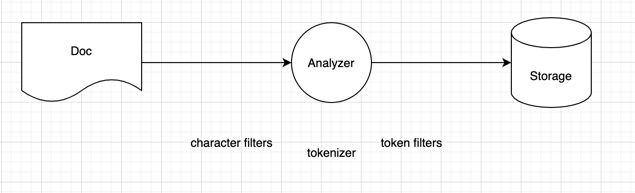

### Introduction to analysis

- Document 가 indexing 될때, Text value 가 analyze 된다.
- analyze 결과가 검색에 효율적인 자료구조상으로 저장된다.
- _source object 자체가 검색에 사용되지 않는다.



#### character filters

문자를 더하거나, 빼거나, 바꾼다. 0개 이상의 필터를 사용할수 있고, 순서를 명시할수 있다.   

#### Tokenizer

하나의 Tokenizer 가 있고, 문자열을 tokenize 한다. (splits into tokens)

#### Token Filters

tokenizer 결과를 받아 토큰에 더하거나, 제거하거나, 수정한다.  
0개 이상의 필터를 사용할수 있고, 순서를 명시할수 있다.


- 이미 정의된 여러 analyzer 가 존재하고, 커스텀하게 만들수도 있다.

#### Standard Analyzer

- character filters : none, tokenizer, token filters : lowercase
```
INPUT : I LIKE apple

character filters output : I LIKE apple
tokeninzer output : [I, LIKE, apple]
token filters output [i, like, apple]
```

#### Analyze API

- Test Standard Analyzer

```
POST /_analyze
{
  "text" : "to test TEXT 1234 !!",
  "analyzer": "standard"
}
analyzer 에 standard 대신 built-in analyzer, custom analyzer 를 사용할수도 있다.
```

결과는 다음과 같다.

```json
{
  "tokens" : [
    {
      "token" : "to",
      "start_offset" : 0,
      "end_offset" : 2,
      "type" : "<ALPHANUM>",
      "position" : 0
    },
    {
      "token" : "test",
      "start_offset" : 3,
      "end_offset" : 7,
      "type" : "<ALPHANUM>",
      "position" : 1
    },
    {
      "token" : "text",
      "start_offset" : 8,
      "end_offset" : 12,
      "type" : "<ALPHANUM>",
      "position" : 2
    },
    {
      "token" : "1234",
      "start_offset" : 13,
      "end_offset" : 17,
      "type" : "<NUM>",
      "position" : 3
    }
  ]
}
```
- token
- type : token type
- start, end offset
- position


standard analyzer 는 심볼, 공백등을 무시하기 때문에, 해당 토큰들은 결과에 나오지 않는다.  
char_filter, tokenizer, filter 를 각각 따로 명시해줄수도 있다.
``` 
POST /_analyze
{
  "text" : "to test TEXT 1234 !!",
  "char_filter": [],
  "tokenizer": "standard",
  "filter": ["lowercase"]
}
```

#### Understanding inverted indices

- 각 필드의 밸류는 각 data type 에 효율적인 자료구조에 저장된다.
- 아파치 루씬에 의해 핸들링된다. 

#### inverted indices

- term(analyzer 의 분석 결과 token) 과 documents 를 맵핑한다.
- terms 는 알파벳 순서로 정렬된다.
- inverted index 는 텀과 doc id mapping 외에도 relevance score 등도 포함할수 있다.
- 한 text field 당 하나의 inverted index 가 생긴다.
- text type 외 다른 data type 은 다른 방식으로 저장된다. (ex. BKD tree)

#### Introduction to mapping

- document 의 structure 를 정의 (field, data types..)
    - value 들이 어떻게 index 되는지도 정의
- RDBMS 의 schema 와 유사 

```
PUT /employees
{
    "mappings" : {
        "properties":{
            "id": { "type" : "integer" },
            "name" : { "type" : "text" },
            "created" : { "type" : "date" }
         }
    }
} 
```

- mapping 엔 두가지 방식 존재
    - Explicit mapping
        - index 생성시 직접 필드를 정의 
        
    - Dynamic mapping
        - ES 가 필드 맵핑을 생성해줌 
    
    - 위 두 방식을 섞어서 사용 가능
    

#### Overview of data types


