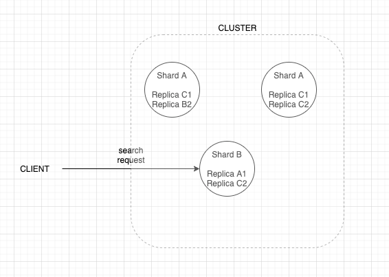

### Search Methods

#### search with request body
``` 
GET /test_index/_search 
{
  "query" : {
    "match" : {
      "tags" : "samsung"
    }
  }
}
```

#### search with request uri
```
GET /test_index/_search?q=tags:samsung AND in_stock :> 3
```

#### Query DSL

- LEAF QUERY
    - 특정 필드 특정 값을 찾는 쿼리. ex) category = Fruit
- COMPOUND QUERY
    - leaf, compound 를 조합할수 있는 쿼, ex) category = Fruit OR category = Vegetable
    
### How Searching works

ES 클러스터가 search query 를 받으면 어떻게 동작할까?  
3개의 노드로 이루어진 클러스터가 있다고 가정을 해보자.  



이 클러스터는 세개의 샤드 (A, B, C), 각 2개의 replica 로 3개의 rep group 으로 이루어져 있다.  

클라이언트가 search query 요청을 보내고, 이 요청이 샤드B를 포함한 노드로 들어왔다고 가정하자.  
이제 이 노드는 coordinating node 로 불리고, 다른 노드로 요청을 보내고 결과를 집약하는 책임을 가진다.  
기본 설정상, 모든 노드는 coordinating 노드가 될수 있다.


### Understanding relevance scores

search query 의 결과엔 문서별로 _score 가 있고, 이 순으로 정렬이 된다.  
일반적인 rdbms 는 매칭된 결과만 반환해주는것과 반해, ES 는 문서들이 얼마나 잘 매칭되었는지를 함께 알려준다.  
ES 는 이 점수를 어떻게 계산할까?  


예전에는 TF/IDF (Term Frequency/Inverse Document Frequency) 라 불리는 알고리즘을 사용했고,  
최근에는 Okapi BM25 라는 알고리즘을 사용한다. (이 알고리즘 말고 customizing 할수도 있다.)  

### TF/IDF
#### Term Frequency
- 문서 내에 해당 term 이 얼마나 많이 있는가? 란 기준
- 대상 field 에 term 이 더 많이 등장할수록, relevance score 는 높아진다.  

#### Inverse Document Frequency
- 인덱스 내에 해당 term 이 얼마나 많이 등장하는가? 란 기준
- 인덱스 내에 term 이 더 많을수록, relevance score 는 낮아진다.

#### Field-length norm
- 필드의 길이가 얼마나 긴가?
- 일반적으로 필드의 길이가 짧은것에 있는 정보가 더 명확하다고 가정 
- 필드의 길이가 짧을수록, 더 가중치가 높다.

### Comparison versus BM25
- better at handling stop words
- Improves the field-length norm factor
- can be configured with parameters

TF 는 특정 term 의 빈도가 많을수록 점수가 지속적으로 높아지지만, BM25 은 특정 값으로 수렴한다.  
따라서 어뷰징 패턴 ex) [갤럭시][갤럭시S20][갤럭시ㅁㅁㅁ] 같은 패턴의 문서가 많더라도 BM25 는 가중치가 수렴하기 때문에 좀더 좋은 품질의 score 를 얻을 수 있다.  
마찬가지 이유로, 불용어도 검색 점수에 영향을 더 미친다.

### Explain API
search api request body 에 explain : true 를 넣으면 점수 계산 과정을 볼수 있다.  
이 외에도 explain API 도 존재한다.


### Query Context vs Filter Context
Query Context 와 Filter Context 의 큰 차이점은 Query context 는 relevance score 를 계산하고, Filter 는 안한다는 것이다.  
filter 는 문서를 특정 조건으로 필터링만 하면 되기 때문에, 점수 계산을 안해도 되는 것이다.  
그래서 성능상의 이점이 있고, 질의 하려는 조건이 점수가 필요하다면 query context, 아니라면 filter context 를 사용하자.

### Full text query vs Term level query

- Term level query
    - exact term match & not analyzed 
    
- Fulltext query
    - analyzed